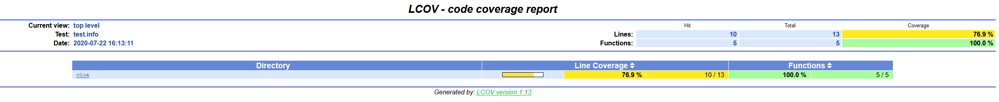
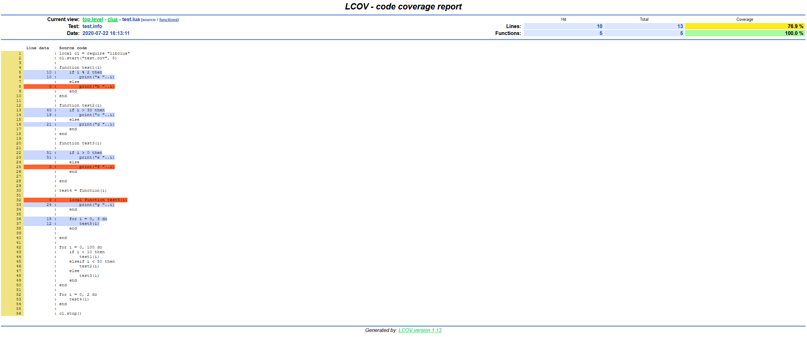

# cLua
[](https://github.com/esrrhs/cLua)
[](https://github.com/esrrhs/cLua)
[](https://github.com/esrrhs/cLua/actions)

lua的代码覆盖率工具

# 特性
* 数据采集用C++编写，性能更高，对宿主进程影响更小
* 简单require即可使用，或通过[hookso](https://github.com/esrrhs/hookso)注入
* 解析器用go编写，通过解析lua语法，精确计算文件及函数的覆盖率
* 支持输出[lcov](http://ltp.sourceforge.net/coverage/lcov.php)格式，进而输出html结果

# 编译
* 编译libclua.so
```
# cmake .
# make
```
* 编译clua解析工具
```
# go get "github.com/milochristiansen/lua" 
# go build clua.go
```

# 使用
* 直接嵌入lua脚本中使用，lua文件里使用如下
```
-- 加载libclua.so
local cl = require "libclua"
-- 开始记录执行过程，生成结果文件
-- 第一个参数为结果文件的文件名
-- 第二个参数为定时生成结果文件的间隔（秒），0表示关闭
cl.start("test.cov", 5)

-- 执行某些事情
do_something()

-- 结束记录
cl.stop()
```
* 或者使用[hookso](https://github.com/esrrhs/hookso)注入到进程中（假设进程id为PID），手动开启
```
a) 首先获取进程中的Lua_State指针，比如进程调用了lua_settop(L)函数，那么就取第一个参数
# ./hookso arg $PID liblua.so lua_settop 1 
123456

b) 加载libclua.so
# ./hookso dlopen $PID ./libclua.so

c) 执行libclua.so的start_cov手动开启，等价于start_cov(L, "./test.cov", 5)
# ./hookso call $PID libclua.so start_cov i=123456 s="./test.cov" i=5

c) 执行libclua.so的stop_cov手动关闭，等价于stop_cov(L)
# ./hookso call $PID libclua.so stop_cov i=123456
```
* 执行完上述两种方法的任一一种，用clua解析test.cov查看结果。clua更多参数参考-h
```
# ./clua -i test.cov
```

# 示例
* 运行test.lua
```
# lua5.3 ./test.lua
```
* 查看目录下，已有test.cov文件
```
# ll test.cov
```
* 查看结果，每行前面的数字表示执行的次数，空表示没被执行，方便定位潜在bug。最后几行显示了总体覆盖率，以及每个函数的覆盖率
```
# ./clua -i test.cov     
total points = 27, files = 1
coverage of /home/project/clua/test.lua:
    local cl = require "libclua"
    cl.start("test.cov", 5)
    
1   function test1(i)
10      if i % 2 then
10          print("a "..i)
        else
            print("b "..i)
        end
11  end
    
1   function test2(i)
40      if i > 30 then
19          print("c "..i)
        else
21          print("d "..i)
        end
41  end
    
1   function test3(i)
    
51      if i > 0 then
51          print("e "..i)
        else
            print("f "..i)
        end
    
52  end
    
    test4 = function(i)
    
        local function test5(i)
12          print("g "..i)
15      end
    
15      for i = 0, 3 do
12          test5(i)
        end
    
4   end
    
102 for i = 0, 100 do
101     if i < 10 then
10          test1(i)
91      elseif i < 50 then
40          test2(i)
        else
51          test3(i)
        end
    end
    
4   for i = 0, 2 do
3       test4(i)
    end
    
1   cl.stop()
    
/home/project/clua/test.lua total coverage 78% 22/28
/home/project/clua/test.lua function coverage [function test1(i)] 66% 2/3
/home/project/clua/test.lua function coverage [function test2(i)] 100% 3/3
/home/project/clua/test.lua function coverage [function test3(i)] 66% 2/3
/home/project/clua/test.lua function coverage [test4 = function(i)] 75% 3/4
/home/project/clua/test.lua function coverage [local function test5(i)] 100% 1/1
```
* 也用lcov查看
```
# ./clua -i test.cov -lcov test.info    
```
* 此时目录下已有```test.info```文件，然后用lcov的工具输出html
```
# genhtml test.info 
```
* 打开目录下的index.html如下

* 点击进入test.lua

* lcov还可以对info文件进行合并，更多操作参考官方文档

## 其他
lua的性能分析工具[pLua](https://github.com/esrrhs/pLua)
