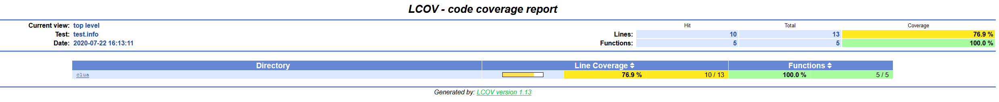
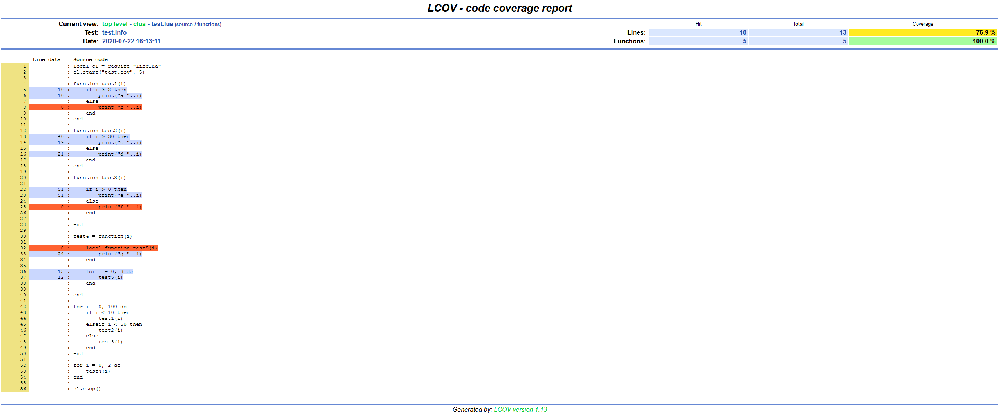

# cLua

[English](README.md) | [简体中文](README_zh.md)

[](https://github.com/esrrhs/cLua)
[](https://github.com/esrrhs/cLua)
[](https://github.com/esrrhs/cLua/actions)

A high-performance, lightweight code coverage tool for Lua (supports Lua 5.3+). Built with a C++ data collection engine and a Go-based AST parser to provide precise, low-overhead line and function coverage statistics.

---

## Table of Contents

- [Features](#features)
- [Architecture & Workflow](#architecture--workflow)
- [Prerequisites](#prerequisites)
- [Build and Installation](#build-and-installation)
- [Usage Guide](#usage-guide)
  - [Method 1: Direct Embedding in Lua Scripts](#method-1-direct-embedding-in-lua-scripts)
  - [Method 2: Dynamic Process Injection via hookso](#method-2-dynamic-process-injection-via-hookso)
- [Analyzing & Visualizing Results](#analyzing--visualizing-results)
  - [Terminal Console Output](#terminal-console-output)
  - [Generating LCOV and HTML Visual Reports](#generating-lcov-and-html-visual-reports)
- [Automated Coverage Service (CluaHelper)](#automated-coverage-service-cluahelper)
- [Related Projects](#related-projects)
- [License](#license)

---

## Features

* 🚀 **High Performance & Low Overhead**: The core data collection library is written in C++ with minimal Lua hook overhead, keeping the performance impact on host applications to an absolute minimum.
* 🔌 **Flexible Integration**: Can be imported directly within scripts using `require "libclua"` or dynamically injected into running production/testing processes via [hookso](https://github.com/esrrhs/hookso) without requiring server restarts or code changes.
* 🎯 **Precise AST Analysis**: The parser is written in Go and analyzes the Lua syntax tree (AST) to compute exact file-level and function-level line coverage metrics and execution counts.
* ⏸️ **Pause & Resume**: Supports `cl.pause()` and `cl.resume()` to selectively exclude critical or non-target code segments during testing.
* 📊 **Rich Visual Reports**: Exports to standard [LCOV](http://ltp.sourceforge.net/coverage/lcov.php) format, allowing seamless HTML report generation with `genhtml`.
* 🌐 **Automated Coverage Service**: Provides `clua_helper` with Client, Server, and Generator modes to automate injection, aggregation, and web hosting across multiple testing environments.

---

## Architecture & Workflow

```text
+-----------------------+
|  Target Process (Lua) |
|  +-----------------+  |
|  |   libclua.so    |  |  == (write coverage) ==>  test.cov (Binary Data)
|  +-----------------+  |                                  |
+-----------------------+                                  |
                                                           v
                                                  +-----------------+
                                                  |   clua (CLI)    |
                                                  +-----------------+
                                                     |           |
                                    (Terminal Stats) v           v (Export LCOV)
                                       Function & File       test.info
                                       Coverage Rates            |
                                                                 v (genhtml)
                                                           HTML Dashboard
```

---

## Prerequisites

* **OS**: Linux (x86_64)
* **Lua**: 5.3 or higher (development headers and libraries such as `lua.h` required)
* **C++ Compiler**: GCC / Clang (with C++11 support)
* **CMake**: 2.8 or higher
* **Go**: 1.19 or higher
* **LCOV** (optional, for HTML reports): install via `apt install lcov` or `yum install lcov`

---

## Build and Installation

### 1. Build C++ Collector Library (`libclua.so`)
```bash
cmake .
make
```
This generates `libclua.so` in the current directory.

### 2. Build Coverage Parser (`clua`)
```bash
go build clua.go
```
This compiles the `clua` command-line utility used to parse binary coverage files.

### 3. Build Coverage Service (`clua_helper`)
```bash
go build clua_helper.go
```
This compiles `clua_helper`, which provides client, server, and report generator services.

---

## Usage Guide

### Method 1: Direct Embedding in Lua Scripts

Load and start the coverage collector inside your Lua scripts:

```lua
-- 1. Load libclua.so
local cl = require "libclua"

-- 2. Start recording coverage
-- Parameter 1: Output coverage file path (default: "luacov.data")
-- Parameter 2: Periodic auto-save interval in seconds (0 = disabled, flushes only on cl.stop())
cl.start("test.cov", 5)

-- (Optional) Pause and resume coverage collection as needed
-- cl.pause()
-- cl.resume()

-- 3. Execute your workload
do_something()

-- 4. Stop recording and flush data to disk
cl.stop()
```

> **Note**: Ensure `LUA_CPATH` includes the directory containing `libclua.so`, for example: `LUA_CPATH="./?.so;;" lua test.lua`.

---

### Method 2: Dynamic Process Injection via hookso

Using [hookso](https://github.com/esrrhs/hookso), you can inject coverage collection into a running process without stopping or recompiling it:

1. **Obtain the `lua_State*` pointer in the target process**:
   For example, inspect the first argument of `lua_settop(L)` (assuming the process ID is `$PID`):
   ```bash
   ./hookso arg $PID liblua.so lua_settop 1
   # Example output: 123456
   ```

2. **Inject and load `libclua.so`**:
   ```bash
   ./hookso dlopen $PID ./libclua.so
   ```

3. **Call `start_cov` to begin profiling**:
   Equivalent to invoking `start_cov(L, "./test.cov", 5)` inside the process:
   ```bash
   ./hookso call $PID libclua.so start_cov i=123456 s="./test.cov" i=5
   ```

4. **Call `stop_cov` to stop profiling and flush data**:
   Equivalent to invoking `stop_cov(L)`:
   ```bash
   ./hookso call $PID libclua.so stop_cov i=123456
   ```

---

## Analyzing & Visualizing Results

### Terminal Console Output

Parse the generated coverage file with the `clua` utility:

```bash
./clua -i test.cov
```

Example output:
```text
total points = 27, files = 1
coverage of /home/project/cLua/test.lua:
    local cl = require "libclua"
    cl.start("test.cov", 5)
    
1   function test1(i)
10      if i % 2 then
10          print("a "..i)
        else
            print("b "..i)
        end
11  end
    
1   function test2(i)
40      if i > 30 then
19          print("c "..i)
        else
21          print("d "..i)
        end
41  end
    
1   function test3(i)
    
51      if i > 0 then
51          print("e "..i)
        else
            print("f "..i)
        end
    
52  end
    
    test4 = function(i)
    
        local function test5(i)
12          print("g "..i)
15      end
    
15      for i = 0, 3 do
12          test5(i)
        end
    
4   end
    
102 for i = 0, 100 do
101     if i < 10 then
10          test1(i)
91      elseif i < 50 then
40          test2(i)
        else
51          test3(i)
        end
    end
    
4   for i = 0, 2 do
3       test4(i)
    end
    
1   cl.stop()
    
/home/project/cLua/test.lua total coverage 78% 22/28
/home/project/cLua/test.lua function coverage [function test1(i)] 66% 2/3
/home/project/cLua/test.lua function coverage [function test2(i)] 100% 3/3
/home/project/cLua/test.lua function coverage [function test3(i)] 66% 2/3
/home/project/cLua/test.lua function coverage [test4 = function(i)] 75% 3/4
/home/project/cLua/test.lua function coverage [local function test5(i)] 100% 1/1
```
The number preceding each line indicates its execution count, while blank entries indicate unexecuted lines. Overall file coverage and per-function coverage summaries are displayed at the end.

---

### Generating LCOV and HTML Visual Reports

1. Export coverage data to standard LCOV info format:
   ```bash
   ./clua -i test.cov -lcov test.info
   ```

2. Generate an HTML dashboard using LCOV's `genhtml`:
   ```bash
   genhtml -o htmltest test.info
   ```

3. Open `htmltest/index.html` to explore the overview report:
   

4. Click into individual source files for line-by-line coverage details:
   

> **Tip**: Multiple `.info` files can be merged together using `lcov` (`lcov -a run1.info -a run2.info -o merged.info`) to combine coverage from multiple test runs.

---

## Automated Coverage Service (CluaHelper)

`clua_helper` provides an automated coverage collection system supporting **Client**, **Server**, and **Generator (Gen)** modes. Run `./clua_helper -h` to see all available flags.

### 1. CluaHelper Client
Runs on the target host, discovers target processes, injects `libclua.so`, monitors source code changes, and reports coverage files periodically to the server:
```bash
./clua_helper -type client \
  -bin target_binary_name \
  -getluastate "command_to_get_lua_state, e.g.: liblua.so lua_settop 1" \
  -path /path/to/source/code \
  -server http://server_ip:8877
```

### 2. CluaHelper Server
Runs on the central server, receives coverage reports from clients, stores files locally, and serves the generated static HTML dashboard:
```bash
./clua_helper -type server -port 8877
```

### 3. CluaHelper Generator
Runs on the central server to aggregate received coverage files, merge results with source code, and generate static HTML reports:
```bash
./clua_helper -type gen \
  -covpath /path/to/server/saved/cov \
  -path /path/to/local/source/code \
  -clientpath /path/to/client/source/code
```

After generation, visit `http://server_ip:8877/static/` in your browser to inspect the live dashboard:


---

## Related Projects

- [lua-family-bucket](https://github.com/esrrhs/lua-family-bucket)
- [hookso](https://github.com/esrrhs/hookso)

---

## License

This project is licensed under the [MIT License](LICENSE).
